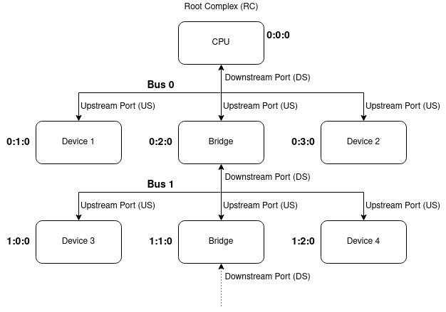

# PCI & PCI-E

- Peripheral Component Interconnect ( Express )
- All the devices connected to the PCI Bus can be retieved by running `lspci` command

## Structure & specification
- Upstream port (US) : device connection towards CPU
- Downstream port (DS) : device connection away from CPU
- Root complex : usually CPU where we have only Downstream ports (DS)
- Endpoint : Devices which have only Upstream ports (US), these are GPU's, Network cards, etc.
- Bridge : Devices which have both Upstream and Downstream Ports, they connect two different buses
- PCI Bus enumuration : search of PCI devices connected through PCI bus and listing them in hierarchical model

## References
- [GNU/Linux & PCI (Express): Part 1 - lspci & PCI bus enumeration - YouTube](https://www.youtube.com/watch?v=l8bnwbqXCmw)